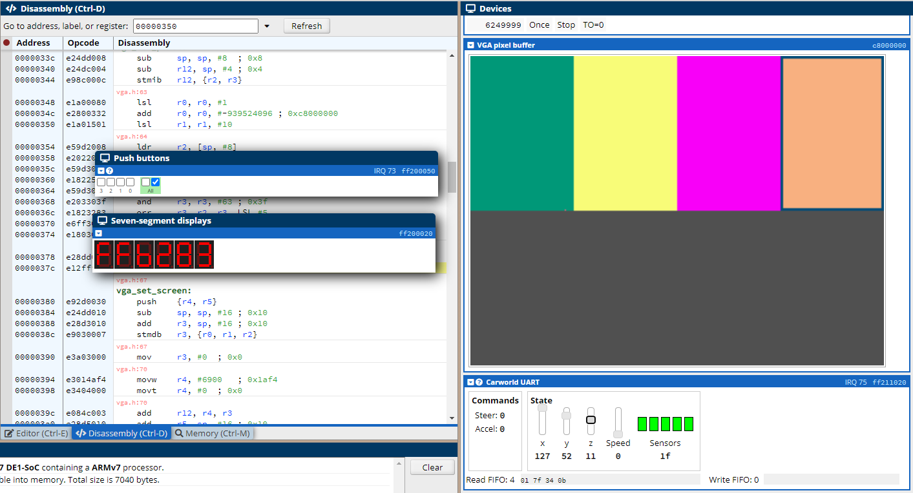

# ARM DE10 Colour Selector (ECE 3375B)
The following code is part of the ECE 3375B final deliverable at the University of Western Ontario. The code and final report were created by Marko Ilic, Kyle Inzunza, Paige Paz, and Jeff St. Jean. The goal was to create an embedded solution to a real-world problem and implement it on [Cpulator's ARMv7 DE10 SoC](https://cpulator.01xz.net/?sys=arm-de1soc). The peripherials are limited but this project makes use of the seven segment displays, integrated push buttons, VGA pixel buffer, and the Carworld UART.

Note on push buttons in the simulator: the buttons have to be manually pressed **and** depressed in order to function properly so make sure to "double click" when using the push buttons.

## Getting Started
1. Downloading [the most recent]() version of the colour selector.
2. Open [the simulator](https://cpulator.01xz.net/?sys=arm-de1soc).
3. Select File > Load.
4. Select the ELF executable that was downloaded in step one (main.axf)
5. Select "Show in separate box" in the dropdown arrow for "Push buttons" and "Seven-segment display" from the the list of peripherals on the right.
6. Scroll the peripheral list down so VGA pixel buffer is in view.
7. Press "Continue" from the toolbar at the top.
8. Use push buttons the first and third push button (from the right) to select a segment within the pixel buffer (indicated by the bordered outline).
9. Use the second button (fron the left) to begin editing the currently selected segment. The border around the segment will get thicker.
10. Use the Carworld UART sliders underneath the VGA display to modify the colour (x for red, y for green, z for red).
11. Reference the seven segment display to see the hex value equivalent of the currently selected colour.
12. Press the second button (from the left) again to save the current segment.
13. Repeat for any other required colours.